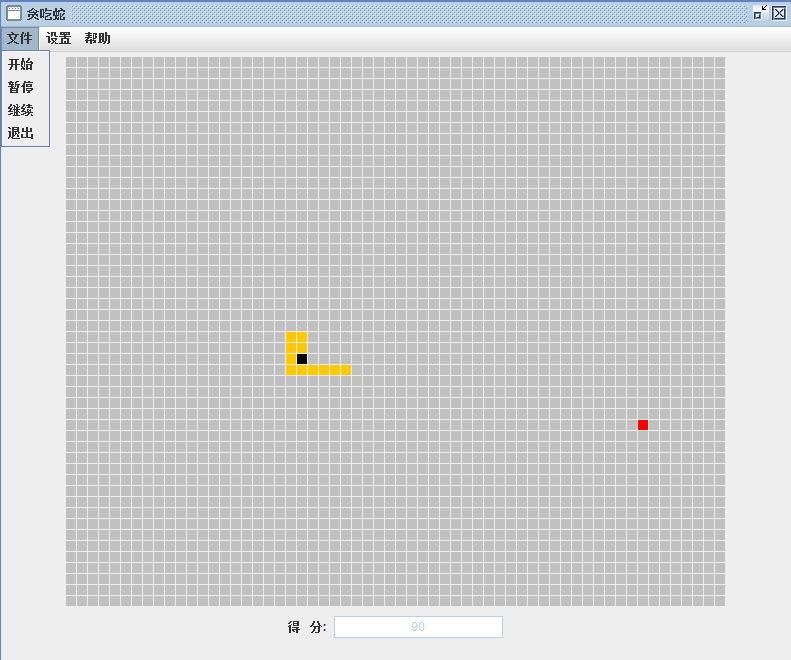
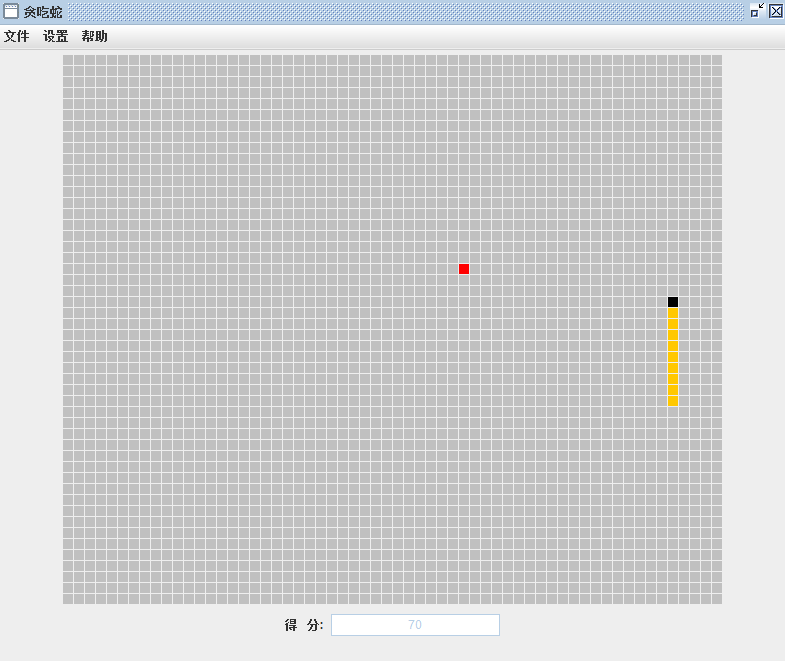
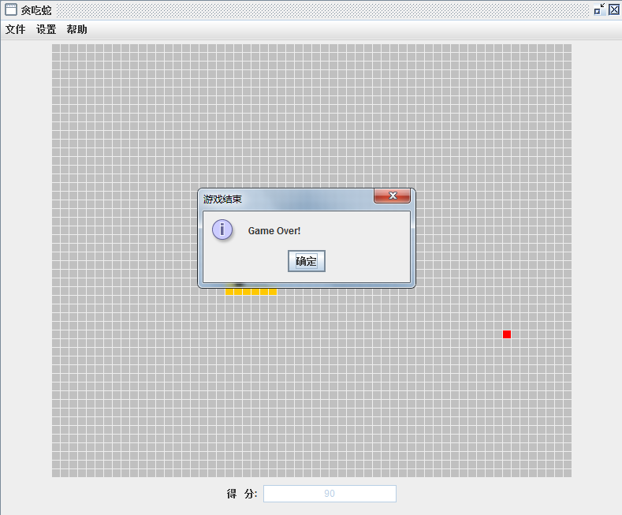
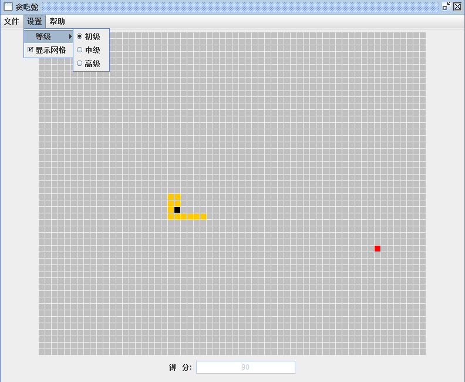
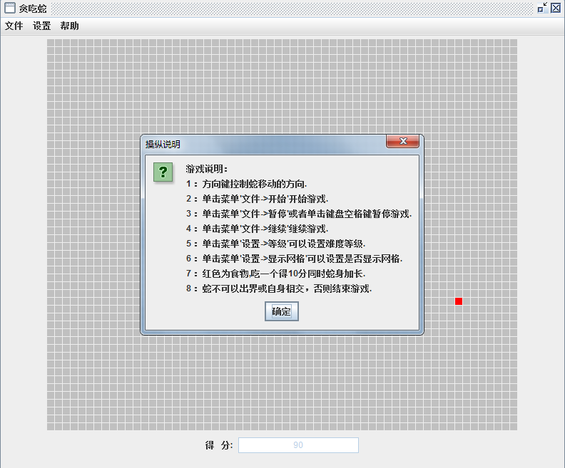

<h1 align="center">贪吃蛇</h1>

## 简介
贪吃蛇游戏设计：包含网格界面、文件设置、游戏难度调整、得分显示和游戏说明，使用方向键控制蛇移动，目标是吃掉红色食物提高得分，避免撞墙或自碰游戏结束。    --计算机毕业设计源码；毕设源码；java毕业设计源码

## 联系方式

<h3 align="center">获取完整代码与数据库文件 + 微信：deepguan QQ: 86050149 QQ群: 783742310</h3>

<h3 align="center">可帮忙远程部署 包运行成功！提供远程部署、修改代码、设计文档指导、代码讲解等服务！</h3>

## 功能介绍（完整见运行截图）
玩家： 操控贪吃蛇在网格地图上移动，吃掉红色食物以增加长度和得分，避免撞墙或自碰导致游戏结束。可选择初级、中级和高级游戏难度，调节速度，通过方向键控制蛇的移动。查看当前得分和最高得分，通过菜单进行游戏开始、暂停、继续及退出操作。

界面设计： 采用简单明了的像素风格，易于理解和操作，适合初学者。顶部菜单栏包括“文件”、“设置”和“帮助”，设置菜单提供游戏难度选择和网格显示功能。界面中央有黄色蛇和红色食物，并在底部显示当前得分。

菜单功能： 包含“文件”、“设置”、“帮助”选项，可进行游戏初始设置、保存进度、获取帮助信息。设置菜单下拉选项允许玩家选择不同游戏难度，开启或关闭网格辅助。游戏结束时显示“Game Over!”提示并确认按钮用于关闭提示框。

游戏规则说明： 通过方向键控制蛇移动，吃食物增加分数，不可撞墙或自碰，达到一定分数则游戏结束。菜单提供开始、暂停游戏功能，并解释基本操作和规则，设置难度和网格显示，游戏说明框展示于界面中央。

## 运行截图

本代码来源于网络,仅供学习参考使用!

